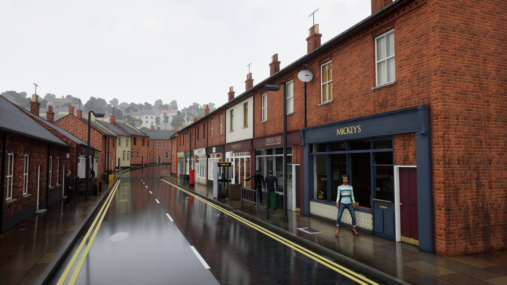
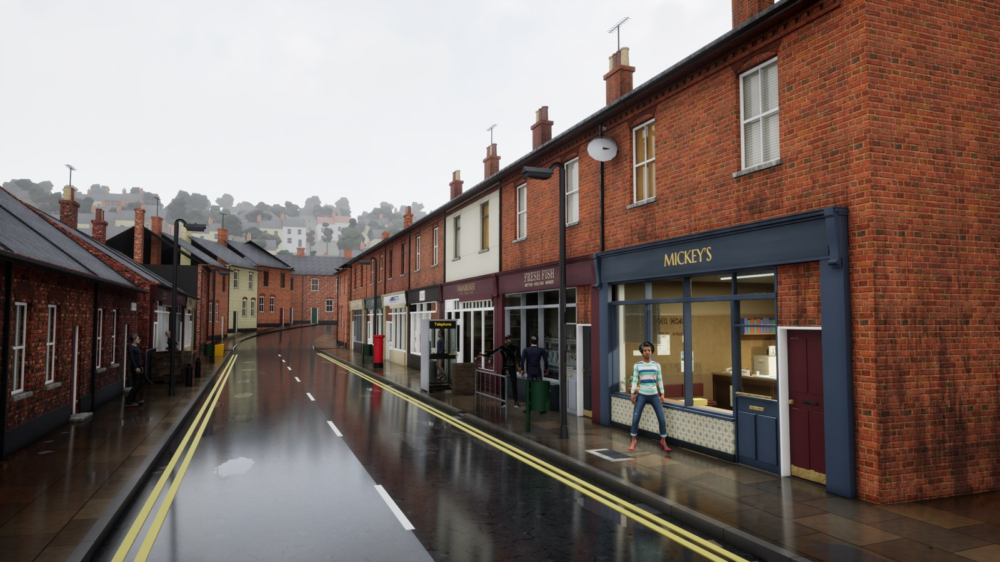
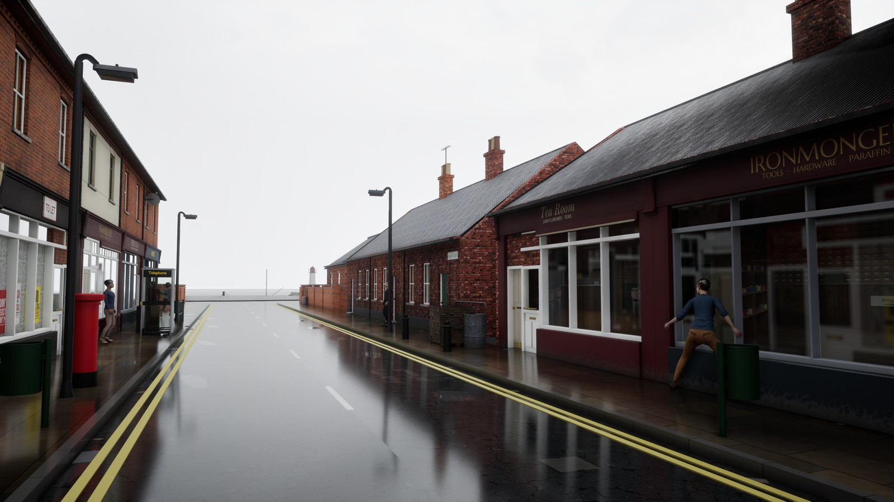
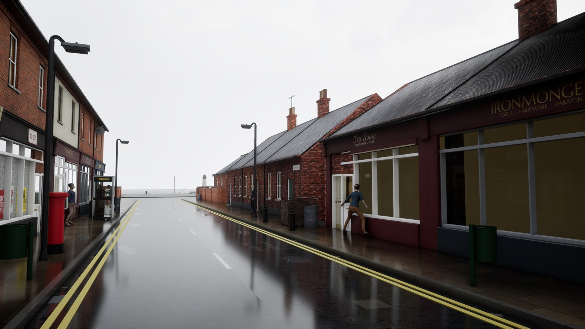
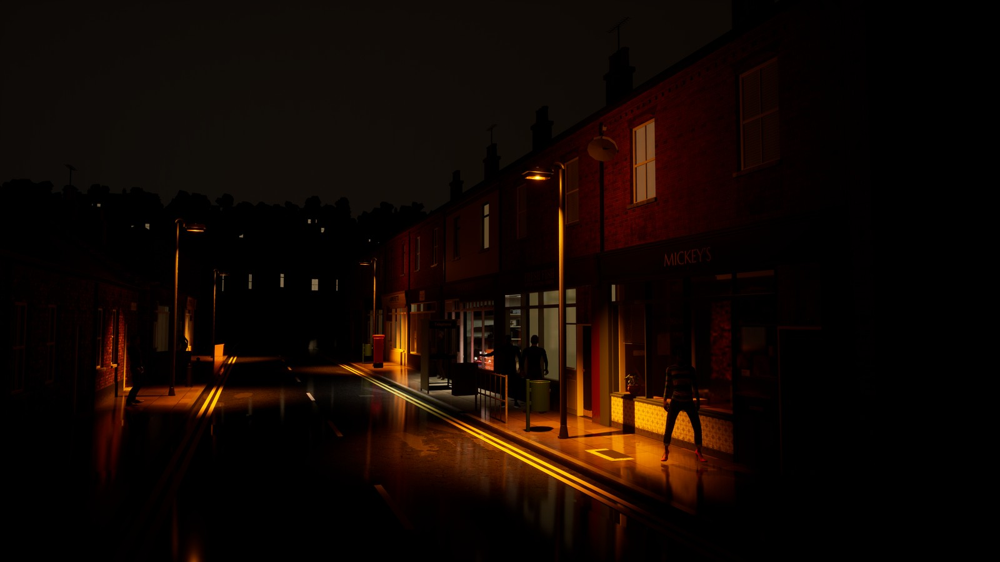
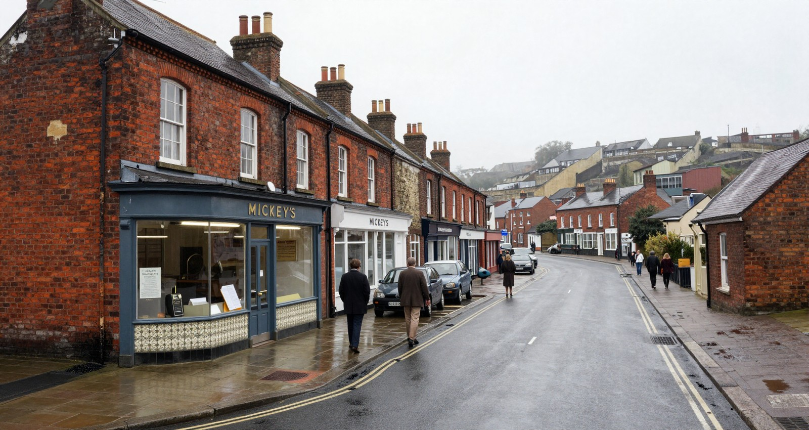

# For Jafar

The overview first; then the day's summary, under 200 words. Earlier summaries are in git and in
production/archive/FOR-JAFAR-to-2026-10-04.md (and FOR-JAFAR-to-2026-09-24.md before that).

## Overview (Thursday 8 October, written in the night and brought up to date before 07:30)

<!-- morning pictures: written by tools/morning_pictures.py -->

**Morning, Thursday 8 October. Phase 1, prove the bottlenecks. On: 1.1 Mickey's front office, frontage, three views: production/research/pre-production/3-PROOFS.md. Next: 1.2 Tom and a speaker: production/casting/CASTING.md.**

| | Today, 08 Oct | Yesterday, 07 Oct |
|---|---|---|
| The hook camera by day |  |  |
| The reverse view |  |  |
| The street at night |  |  |

The Hook sheet, the bar they are held to: 

No decision asked: these are for watching the street change.

<!-- /morning pictures -->

Disk (10-08 03:45): C: 88.5 GB free, F: 38.4 GB free (retention's floors: 40 and 20).

**Phase 1: on 1.1 (Mickey's office and Rita's front); its third review did not pass.** Your new gate ran for the first time (one reviewer per view, each beside its last good picture; [the review](production/audits/phase1-exit/GATE-1.1-REVIEW-3.md)). Every change of last evening did what it was meant to and made no fault: the black block, the roofs, the west shops' rooms, Sheila and Ron out of the office camera, grime at the tiles' foot. Blocking are faults newly seen: the street's walkers walk through things (the crates, an oil drum, each other); Mickey's office (a blind that stops short, a blank white slab, a chair Tom walks through, window-frame pieces poking into the room); and three of the review's own views framed too high to see a front's foot. Fixed by 04:30 and seen in the editor: the walkers kept out of the yard's crates and barrel, the stacking chair solid, the office's grime off the door frame, and each shop photographed whole from across the road ([picture](production/previews/shop-fronts-whole-2026-10-08.jpg)); and by 05:45 the office rebuilt: the open door flat on its wall, the blind fitted to its pane, the slab and the chair gone, and Ron's rank spot moved off the doorway's line; the grey slab past Mickey's end (the sky photograph's trees, stretched) gone. In the editor Tom stops at the office door (its room collides there; the packaged game let him in at 03:45): tonight's packaged walk-in is the test. Not narrow, but known: the cast's base layer, the glass at night, Rita's white sawtooth, faint wear on painted fronts, a bare sky. **1.2:** turning, sitting down and standing up work in the editor and are in last night's build; the walk slides at its joins; Tom's face blocked (Needs you 1); clothes failed (Needs you 3). **1.3, speech:** failed, a blocked capability. **1.4, P1:** complete.

**The tester's walk (8 October, 03:04, last night's build):** 10 of 13 stages. It never found Sheila on the street to talk to, and lost her the next day; Ron stayed 8.5 m away; it talked with Darren (words in 0.2 s, the stand-in's). Darren and Hana saw the window broken; Ron showed he knew. What broke the illusion, by its eyes: Tom's stand-in stands splay-legged and stiff; three frames pitch black; the camera inside Tom's back; "Talk to Ron" offered while he stood in an unlit doorway; walkers frozen mid-stride, one foot through the tea room's step. The sixty-question bench measured nothing again. Why it missed Sheila: the route's, not the game's. The game writes nobody's place during her opening lines, which now turn page by page, and the route's five presses no longer ended them. Fixed, the same walk passed 15 of 15 at 06:10, talking to Sheila, Ron and Darren.

**Risks, Monday's review (production/research/pre-production/6-RISKS.md).**
- R3, the street missing the bar: up, 25. The audit finds the visual method unproved: five proof-view steps were set aside, and Mickey's room failed three reviews. Phase 1's binding stop answers it.
- R1, empty or unchecked talk: level, 25. The bench's 23 to 25 empty answers have not been re-run; in play, 0 of 8 were empty (P4).
- R2, slow replies: up, 25. Measured on the real path 7 October: first sound 4.6 s median, none within two seconds; a blocked capability by your answer.
- R10 and R7, the friends' evening: down, 9 and 10. It runs on your account with its $5 cap and no second account. The Shipping launch and the limits surviving a restart are proved in 0.6.
- R9, the way of working: level, 12. Orders now come weekly and there is one session, but that holds only if shown.

### Needs you

(Your lighting answer, 13:25: day and night now, four or five lighting states with transitions later; in RULINGS.md. Your voice page read back at 13:00: speech reported failed as a blocked core capability, no third attempt at the voice, the faster first sentence off; in RULINGS.md. Every page's answers read back at 03:50 on 8 October: 147, none new. Your three answers of this morning are in RULINGS.md and gone from here: the voice's route, the NoAI folders, and the sitting clips, which were already in last month's Mixamo harvest with their travel.)

1. **Tom's face is blocked** (14:40): the one more try could not set his brows' colour, the cause the research found: the face plugin offers no colour settings to a script before, during or after a build. Recommended: one more day's research on the other route (the finished face's own brow settings, as his hair's are set), then a page with the result; or you pick the closest existing take for now. Research, or pick?
2. **The check study you asked for** (added 13:00; [the proposal](production/research/invented-claims/CHECK-FLOOR-PROPOSAL-2026-10-07.md)): one day and at most $1, three ways to clear the first sentence sooner, measured on the bench. The limit: with today's voice kept, even an instant check leaves the voice's own 1.6 to 4.4 s, so it cannot bring speech under two seconds in the game. Recommended: park it until a faster voice is on the table. Yes to run it now, or park?
3. **Plain clothes for the cast: a failed capability for now** (21:00). Both routes your rulings allow have failed: the outfit made in Blender failed three fresh reviews on shape ([the third](production/audits/clothing/RON-OUTFIT-REVIEW-3.md)); tonight's one try with two free ready-made pieces (MakeHuman's fisherman's jumper and wool trousers, CC0) failed its own measured checks, skin showing through the jumper among them. The cast stays in the white base layer. What is left needs you: a garment tool or bought clothes (your rulings say no), or a later look when the tools improve. Recommended: keep the base layer through phase 1 and report clothes as failed. Keep it, or open one of those?

### Road to worth playing (PLAN.md)

- **0. Recover control** (0.20W): done 6 October, passed by a fresh review with narrow points.
- **1. Prove the bottlenecks** (1.00W): Mickey's front office first, then a complete Tom and one speaker, the voice under two seconds, and P1 packaged. If a sample fails within its ceiling, I report the failed capability.
- **2. Quay Street from proved families** (2.00W): the brick, the facades, the wet street's seam and the hill return here.
- **3. Thirty minutes that hold** (0.75W): N3 ported, the weather proof, P4's gaps.
- **4. The friends' candidate** (0.50W): on your own account, $5 an evening.
- **5. The first town:** after the pilot.
- **Friends:** eight to twelve weeks, if phase 1 passes; low confidence.

## Builder, Thursday 8 October

**Failed:** item 1.1's third review, the first by your new gate: no change of last evening made a fault, but newly seen ones block: walkers and Tom walk through things, faults in Mickey's office, and three views framed too high; most fixed by 06:00. The speaker's walk: where its clips join, a planted foot slides 13 to 27 cm (the bar is 3 cm). The tester never found Sheila on the street.

**Done (in tonight's build):** turning: if someone Tom talks to has turned away, they turn to face him: asked 100°, turned 99.6° ([picture](production/previews/turn-to-him-2026-10-08.jpg)). Sitting: Ron, on the office bench in his evening hours, stands up and sits down again, landing within 1 cm of his seat with no foot slip ([picture](production/previews/sit-stand-office-2026-10-08.jpg)). The library's own turns crouched and its only sit-down bent him double, so the right turn is a left turn mirrored and the sit-down is the stand-up played backwards. Your gate ruling is in; tonight's review has ten views, one reviewer each.

**Two-tries rule broken:** the walk's joins: three tries before the research, three after it; set aside.

**Act on:** Tom's face: research the other route, or pick a take?

## Builder, Wednesday 7 October

**Failed:** speech: 4.6 s median, 4.0 with a faster first sentence; a blocked capability, your answer. Item 1.1's second review: the glass worst, then the office lit, the cast's base layer, a black block, faint wear. Tom's face: blocked. Plain clothes: the made outfit failed its third review and the ready-made CC0 pieces their checks; failed for now (Needs you 3).

**Fixed:** the frame: 59 and 51 fps to 80 with the voice speaking, card peak 5.9 GB. The glass lit and reflecting the street. Mickey's office dark until the key; the black post and white strip. Since the review: the black block (houses without sides), the west shops' rooms, the roofs' seams, Sheila and Ron out of the office camera, Enter showing a line's end; in tonight's build. The glass still steps; the shopfront wear never showed; now the grime is in the paint itself. Your two faults done.

**Two-tries rule broken:** the glass, twice: past three tries before a measurement found the cause; tonight a third anti-aliasing try without fresh research. Kept: the wear stopped at two.

**Act on:** Tom's face: research the other route, or pick a take?

## Builder, Tuesday 6 October

**Done:** phase 0 passed its recheck. 1.1's review faults fixed and walked in the packaged game: reflections, a harbour at the street's end, the locked office lighting up as Tom enters, wear, ashtray, map. Walking carries real travel. Your build ruling is in.

**Failed:** 1.1's first review; P2, the voice; the walk-in three times (a door bar, an engine warning, a leftover picture in the doorway; fixed); last night's measurement and walk, lost when my session closed at 00:30 (I had ended my turn to wait for the night's jobs to wake me; the program closed while idle, nothing in Windows' logs says why).

**Two-tries rule broken twice:** Tom's face, ten passes before it was set aside; the sky's band, five tries in one evening before the photograph was measured.

**Your question, builds:** 8 yesterday, 17 to 36 minutes (median 31; 3.2 hours): 15 cooking and packaging, 6 a second cook kept only as a measurement (removed), 9 tests and pictures. While one runs the graphics card stays free: code, records, research, reviewers; editor work waits.

**Act on:** nothing; the voice's numbers come on one screen.

## Builder, Monday 5 October

**Done:** your plan adopted with its ten edits; phase 0's items 0.1 to 0.6; the history cleaned into the new repository (30.8 GB to 3.2 GB), with guards before every push here and on GitHub, nine workflows retired, the tests green on GitHub. Every page's answers read back: 144, none new.

**Failed, then fixed:** phase 0's fresh reviewer failed it on eleven old jobs waiting on GitHub to run on this PC (one installs a scheduled task); the reconnect now refuses while any wait. A retired job put a 16 MB picture on main: taken off. The finished game carried a jacket made in Marvelous Designer's evaluation-only trial: now never built in, and a check traces every file the package ships to its source (6,585 of 6,585).

**Evidence:** checks 62/62 here; the core tests green on GitHub; the Shipping package rebuilt twice; the friends' evening re-run across a restart from the real shortcut (6.7 cents of calls).

**C:** 57.2 GB free, **F:** 22.5 GB.

**For you:** cancel the eleven old jobs (or leave them to lapse about 13:20), then reconnect the build machine.

## Builder, Sunday 4 October

**No page today:** nothing passed the gate. [The proof view, one frame a step](https://claude.ai/artifact/CaQ73RAcLMk1zqvqaNYt3r).

**Done:** your six answers applied; P5 on your own account; the history plan written (Needs you 1). Mickey's office furnished behind its window; every shop's board lettered by us; poll-tax bills; the image model's 41 worded pictures retired (kept on F:); cornices, brackets, panelled doors; the cottage doors' "pale slab" fixed; the brand bible put right. The atlas kept off main, as you ordered.

**Failed:** the facades and Mickey's room, each after three fresh reviews (Needs you 3 and 4). Found: the street is lit by a sky 41% as bright as the one seen.

**Evidence:** checks 47/47; core tests 5,077; engine checks 693/693; both game targets built today; previews of every try in production/previews. Committed here, not pushed: none of it has passed its gate yet.

**C:** 72 GB free, **F:** 23 GB. Backup with this commit.

**For you:** your four answers are recorded; I act on them Monday, starting with the five set-aside steps judged again by your narrow-points rule.
