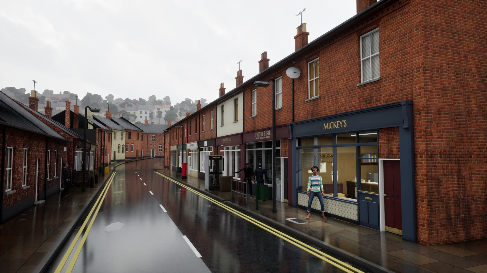
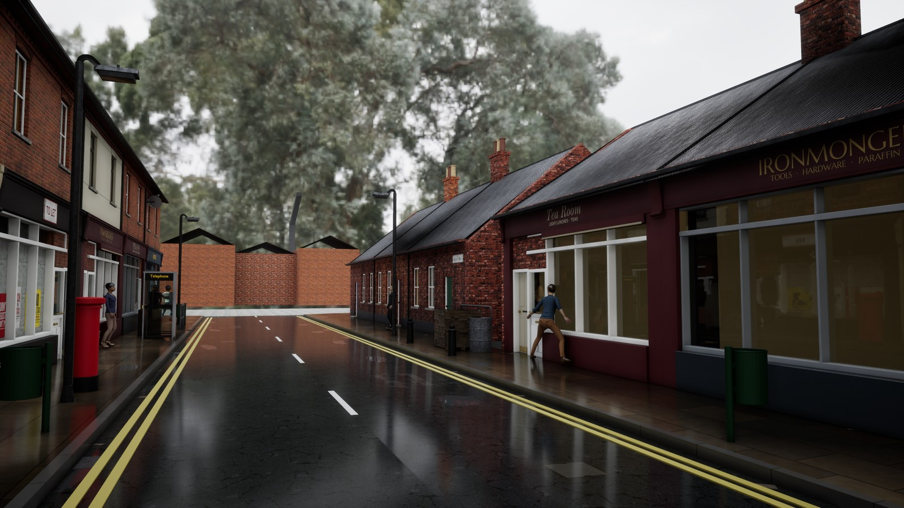

# For Jafar

The overview first; then the day's summary, under 200 words. Earlier summaries are in git and in
production/archive/FOR-JAFAR-to-2026-10-04.md (and FOR-JAFAR-to-2026-09-24.md before that).

## Overview (Monday 5 October, 08:20)

<!-- morning pictures: written by tools/morning_pictures.py -->

**Morning, Monday 5 October. Phase 0, recover control. On: 0.7 History cleaning: plan to him, sessions stopped. Next: 0.8 Exit: fresh reviewer.**

| | Today, 05 Oct | Yesterday, 04 Oct |
|---|---|---|
| The hook camera by day |  | none |
| The reverse view |  | none |
| The street at night |  | none |

The Hook sheet, the bar they are held to: 

No decision asked: these are for watching the street change.

<!-- /morning pictures -->

Disk (10-05 04:30): C: 73.1 GB free, F: 24.4 GB free; grew most since 10-04 04:30: F:\LedgerTools\renders\proof-2.6 +0.5 GB, F:\LedgerTools\tmp\builder +0.2 GB, C:\actions-runner-ledger\_work\renders +0.1 GB.

**On: phase 0, recovering control (PLAN.md).** Done, 0.1: your charter and plan, with your ten edits, are adopted as CHARTER.md and PLAN.md; the audit and both drafts are saved in production/audits; every old list is retired to production/archive/2026-10-05-retired (the builder's list, the roadmap, the town's and clothing's lists, the open handovers, Sunday's 35-item reconciliation); TOWN.md and CLOTHES.md are short task briefs within their caps, nothing exempt; your edits are in CLAUDE.md and the weather in RULINGS.md. **Next, 0.2:** the time log and the morning pictures. They start tomorrow at 07:30; none today, because the plan arrived after that time. Then 0.3, the sweep of every branch, drive folder, page answer and the old studio repository.

**The tester's walk (5 October, 02:30, stand-in words).** It walked the whole route, 15 of 15 stages. Eight people saw Tom break Rita's window. Only Ron showed afterwards that he knew. The sixty-question bench measured nothing again, and the walk saved no pictures. Both are open faults in FINDINGS.md.

**Risks, Monday's review (production/research/pre-production/6-RISKS.md).**
- R3, the street missing the bar: up, 25. The audit finds the visual method unproved: five proof-view steps were set aside, and Mickey's room failed three reviews. Phase 1's binding stop answers it.
- R1, empty or unchecked talk: level, 25. The bench's 23 to 25 empty answers have not been re-run; in play, 0 of 8 were empty (P4).
- R2, slow replies: level, 20. The median first sound is 4.6 s, the text alone 2.5 s; phase 1's P2 is the test.
- R10 and R7, the friends' evening: down, 9 and 10. It runs on your account with its $5 cap and no second account. The Shipping launch and the limits surviving a restart are proved in 0.6.
- R9, the way of working: level, 12. Orders now come weekly and there is one session, but that holds only if shown.

### Needs you

(All recent pages' answers re-read at 08:10: nothing new since Sunday. The full read of every page is part of 0.3.)

1. **[Monday's sweep](https://claude.ai/artifact/Pm1pF3ygCGW3nym14UvjYS), one tap.** The September map of the town: make it the town's map (recommended). Its second question is settled by the new repository: the 68 old branches stay in the private archive.
2. **The build machine, when you are back at the PC (about two minutes):** open PowerShell as administrator and run `powershell -NoProfile -ExecutionPolicy Bypass -File C:\Users\Jafar\ledger-local\tools\runner\reconnect.ps1`; it asks for the token from GitHub's new-runner page and your Windows password, which only you type.
3. **Tell me when everything works,** so the safety copy of the old history on C: can go and free about 28 GB.
4. **The NoAI material, yours to delete.** Deleting files for good is not mine to do even on your word. In Explorer: F:\LedgerTools\quarantine-noai-2026-10-03 (18 GB), and in Dropbox's LEDGER backup\versions the folders 2026-10-03-1258, 2026-10-03-1259 and 2026-10-03-1311. Then empty the Recycle Bin.

Retired, not asked: the brick-and-facades choice (the plan rebuilds them from the kit in phase 2), the suit purchase and the tailoring questions (stopped by your rulings and the plan).

### Road to worth playing (PLAN.md)

- **0. Recover control** (0.20W): in hand, 0.1 of 8 done.
- **1. Prove the bottlenecks** (1.00W): Mickey's front office first, then a complete Tom and one speaker, the voice under two seconds, and P1 packaged. If a sample fails within its ceiling, I report the failed capability.
- **2. Quay Street from proved families** (2.00W): the brick, the facades, the wet street's seam and the hill return here.
- **3. Thirty minutes that hold** (0.75W): N3 ported, the weather proof, P4's gaps.
- **4. The friends' candidate** (0.50W): on your own account, $5 an evening.
- **5. The first town:** after the pilot.
- **Friends:** eight to twelve weeks, if phase 1 passes; low confidence.

## Builder, Sunday 4 October

**No page today:** nothing passed the gate. [The proof view, one frame a step](https://claude.ai/artifact/CaQ73RAcLMk1zqvqaNYt3r).

**Done:** your six answers applied; P5 on your own account; the history plan written (Needs you 1). Mickey's office furnished behind its window; every shop's board lettered by us; poll-tax bills; the image model's 41 worded pictures retired (kept on F:); cornices, brackets, panelled doors; the cottage doors' "pale slab" fixed; the brand bible put right. The atlas kept off main, as you ordered.

**Failed:** the facades and Mickey's room, each after three fresh reviews (Needs you 3 and 4). Found: the street is lit by a sky 41% as bright as the one seen.

**Evidence:** checks 47/47; core tests 5,077; engine checks 693/693; both game targets built today; previews of every try in production/previews. Committed here, not pushed: none of it has passed its gate yet.

**C:** 72 GB free, **F:** 23 GB. Backup with this commit.

**For you:** your four answers are recorded; I act on them Monday, starting with the five set-aside steps judged again by your narrow-points rule.
