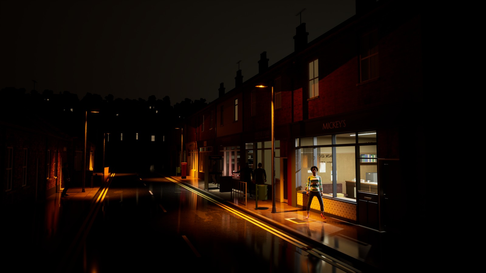

# For Jafar

The overview first; then the day's summary, under 200 words. Earlier summaries are in git and in
production/archive/FOR-JAFAR-to-2026-10-04.md (and FOR-JAFAR-to-2026-09-24.md before that).

## Overview (Tuesday 6 October, 21:00)

<!-- morning pictures: written by tools/morning_pictures.py -->

**Morning, Wednesday 7 October. Phase 1, prove the bottlenecks. On: 1.1 Mickey's front office, frontage, three views: production/research/pre-production/3-PROOFS.md. Next: 1.2 Tom and a speaker: production/casting/CASTING.md.**

No morning pictures today: the film ran past 30 minutes and was stopped. Yesterday's stand below.

| | Today, 07 Oct | Yesterday, 06 Oct |
|---|---|---|
| The hook camera by day | none |  |
| The reverse view | none |  |
| The street at night | none |  |

The Hook sheet, the bar they are held to: 

No decision asked: these are for watching the street change.

<!-- /morning pictures -->

Disk (10-06 04:30): C: 52.0 GB free, F: 26.2 GB free; grew most since 10-05 04:30: C:\LedgerTools\history-safety-2026-10-05.git\objects +33.4 GB, C:\Users\Jafar\ledger-local\ue-probe +12.7 GB, C:\Users\Jafar\ledger-local\.git\objects +3.3 GB.

**Phase 0 is done; phase 1 runs in parallel, your pick.** **1.1, Mickey's office and Rita's frontage:** failed its first fresh review at 17:00 (the world's edge past the street's south end, window glass with no street in it, the shop door missing in the walk-in, no visible wear, no ashtray or map that read). All answered by 21:00: the windows mirror the street across the road; the street now runs on to a harbour built to your map, the sky's own fields and trees held back; the office door is locked until Tom comes with the key, and the lights go on as he steps in; wear on the counter and Rita's front; a real ashtray and the map. The packaged game is building; then the walk-in and a second fresh review. **1.2, Tom:** his face on its tenth pass (the fifth blind review: "one narrow round away"); walking now carries real travel (Epic's clips had none; it is worked out from the feet). Sitting still needs your two Mixamo clips. **1.3, the voice:** your answer below. **1.4:** the packaged run tonight, after the build.

**The tester's walk (6 October, 02:30, stand-in words).** 14 of 15 stages; it lost sight of Darren. Seven people saw Tom break Rita's window; only Ron showed afterwards that he knew. The sixty-question bench was not measured and the walk saved no pictures, both still open in FINDINGS.md.

**Risks, Monday's review (production/research/pre-production/6-RISKS.md).**
- R3, the street missing the bar: up, 25. The audit finds the visual method unproved: five proof-view steps were set aside, and Mickey's room failed three reviews. Phase 1's binding stop answers it.
- R1, empty or unchecked talk: level, 25. The bench's 23 to 25 empty answers have not been re-run; in play, 0 of 8 were empty (P4).
- R2, slow replies: level, 20. The median first sound is 4.6 s, the text alone 2.5 s; phase 1's P2 is the test.
- R10 and R7, the friends' evening: down, 9 and 10. It runs on your account with its $5 cap and no second account. The Shipping launch and the limits surviving a restart are proved in 0.6.
- R9, the way of working: level, 12. Orders now come weekly and there is one session, but that holds only if shown.

### Needs you

(Every page's answers read back at 07:22: 145; one new, your map: adopt it, updated to the built street. Recorded in RULINGS.md, D13.)

1. **The voice: pay, or keep the delay?** (money; P2 failed, 6 October.) Moving the free voice off the graphics card was measured two ways: it spares the game, but Sheila still takes about 3.4 s to start speaking, against 1 s needed. **(A) Keep the free voice and its delay, covered by short prepared openings: recommended.** (B) A paid streaming voice, about $0.28 an hour of play; the voices would be recast and need a licence entry. (C) One more free try with a shorter voice sample, which changes how the voices sound a little.
2. **Two Mixamo clips** (only you can sign in): at mixamo.com, "Stand To Sit" and "Sit To Stand", each Download as FBX Binary, Without Skin, 30 fps, no keyframe reduction ("In Place", if shown, left unticked), left in Downloads. Tom sits and stands up with them (item 1.2).
3. **The NoAI material, yours to delete.** Deleting files for good is not mine to do even on your word. In Explorer: F:\LedgerTools\quarantine-noai-2026-10-03 (18 GB), and in Dropbox's LEDGER backup\versions the folders 2026-10-03-1258, 2026-10-03-1259 and 2026-10-03-1311. Then empty the Recycle Bin.

Retired, not asked: the brick-and-facades choice (the plan rebuilds them from the kit in phase 2), the suit purchase and the tailoring questions (stopped by your rulings and the plan).

### Road to worth playing (PLAN.md)

- **0. Recover control** (0.20W): done 6 October, passed by a fresh review with narrow points.
- **1. Prove the bottlenecks** (1.00W): Mickey's front office first, then a complete Tom and one speaker, the voice under two seconds, and P1 packaged. If a sample fails within its ceiling, I report the failed capability.
- **2. Quay Street from proved families** (2.00W): the brick, the facades, the wet street's seam and the hill return here.
- **3. Thirty minutes that hold** (0.75W): N3 ported, the weather proof, P4's gaps.
- **4. The friends' candidate** (0.50W): on your own account, $5 an evening.
- **5. The first town:** after the pilot.
- **Friends:** eight to twelve weeks, if phase 1 passes; low confidence.

## Builder, Monday 5 October

**Done:** your plan adopted with its ten edits; phase 0's items 0.1 to 0.6; the history cleaned into the new repository (30.8 GB to 3.2 GB), with guards before every push here and on GitHub, nine workflows retired, the tests green on GitHub. Every page's answers read back: 144, none new.

**Failed, then fixed:** phase 0's fresh reviewer failed it on eleven old jobs waiting on GitHub to run on this PC (one installs a scheduled task); the reconnect now refuses while any wait. A retired job put a 16 MB picture on main: taken off. The finished game carried a jacket made in Marvelous Designer's evaluation-only trial: now never built in, and a check traces every file the package ships to its source (6,585 of 6,585).

**Evidence:** checks 62/62 here; the core tests green on GitHub; the Shipping package rebuilt twice; the friends' evening re-run across a restart from the real shortcut (6.7 cents of calls).

**C:** 57.2 GB free, **F:** 22.5 GB.

**For you:** cancel the eleven old jobs (or leave them to lapse about 13:20), then reconnect the build machine.

## Builder, Sunday 4 October

**No page today:** nothing passed the gate. [The proof view, one frame a step](https://claude.ai/artifact/CaQ73RAcLMk1zqvqaNYt3r).

**Done:** your six answers applied; P5 on your own account; the history plan written (Needs you 1). Mickey's office furnished behind its window; every shop's board lettered by us; poll-tax bills; the image model's 41 worded pictures retired (kept on F:); cornices, brackets, panelled doors; the cottage doors' "pale slab" fixed; the brand bible put right. The atlas kept off main, as you ordered.

**Failed:** the facades and Mickey's room, each after three fresh reviews (Needs you 3 and 4). Found: the street is lit by a sky 41% as bright as the one seen.

**Evidence:** checks 47/47; core tests 5,077; engine checks 693/693; both game targets built today; previews of every try in production/previews. Committed here, not pushed: none of it has passed its gate yet.

**C:** 72 GB free, **F:** 23 GB. Backup with this commit.

**For you:** your four answers are recorded; I act on them Monday, starting with the five set-aside steps judged again by your narrow-points rule.
