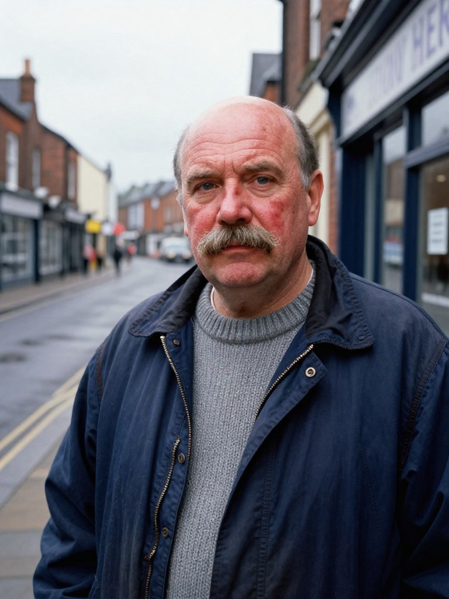
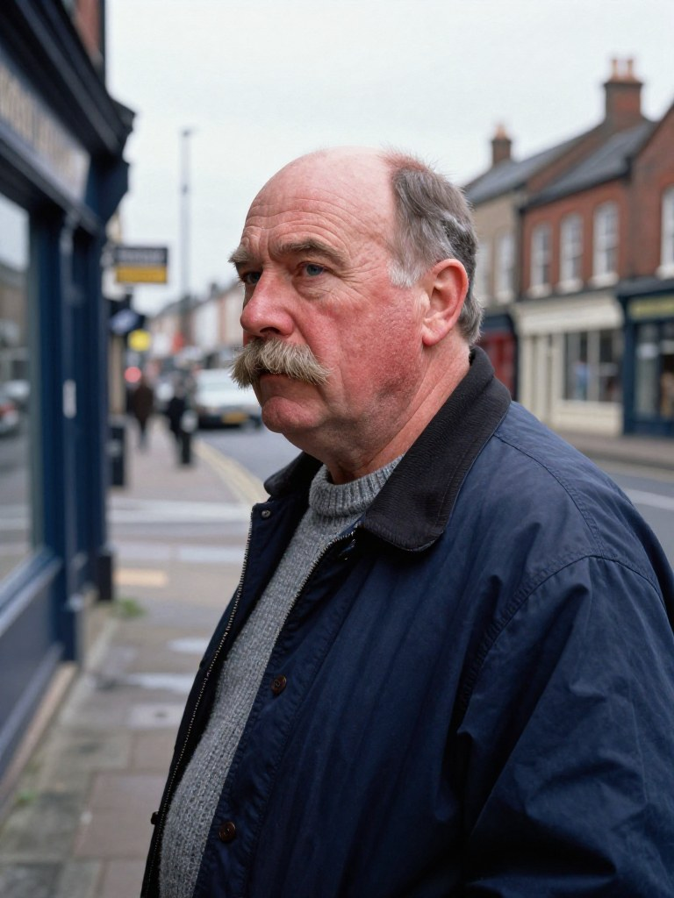
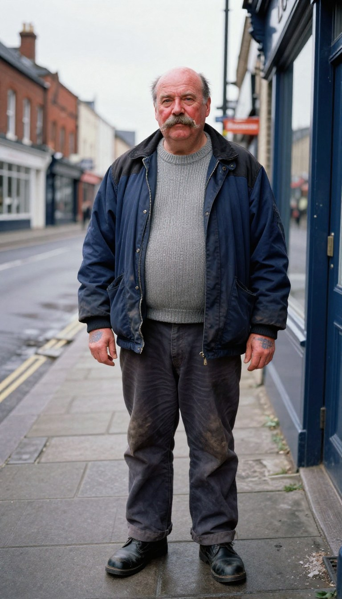

# Ron Kirby

A principal of LEDGER (production/casting/CASTING.md). Until 24 September the
character was called Rocco; the old name survives only as an internal id.

| | |
|---|---|
| **Age** | 58 (born 1932) |
| **Occupation** | A docker until the dock labour scheme ended in 1989. Mickey kept him on the door and the rank. |
| **Face** | Broad, weathered and ruddy; a nose broken long ago; heavy-lidded, patient eyes. |
| **Body** | Big and heavy-set, about 6 ft 1 in, a thick neck; big hands with faded blue tattoos on the backs and forearms. |
| **Hair** | Bald on top, a short grey fringe at the sides; a full grey-brown moustache. |
| **Clothes, 1990** | A navy donkey jacket with a black shoulder panel over a grey knitted jumper; dark grey work trousers; scuffed black leather boots. |
| **Voice** | Low, worn, tired; decency without softness. |

## Concept portraits

Made in the image lane (Z-Image-Turbo, Apache-2.0), an invented person not
based on anyone, in the street's overcast light. What the MetaHuman is built
to once this sheet is approved.

| front | profile | full length |
|---|---|---|
|  |  |  |

## Three lines

1. "Forty years on the docks and they finished it with a letter. Mickey gave me the door. I don't forget that."
2. "You want to stand there, son, you stand where I can see you. That's all I ask."
3. "Nobody's asked me yet. When they do, I'll tell them the truth, and I'll tell you first."

Spoken by each voice candidate in voices/, named by letter so they are heard
blind; which letter is which is in ../voice-key.json.

## Approval

Face, clothes and voice are approved together, on the sitting's approval
page. The approval, when given, is SHEET.md.approval.json beside this file
(tools/approvals.py), and lapses if this sheet, its pictures or its voice
change.
