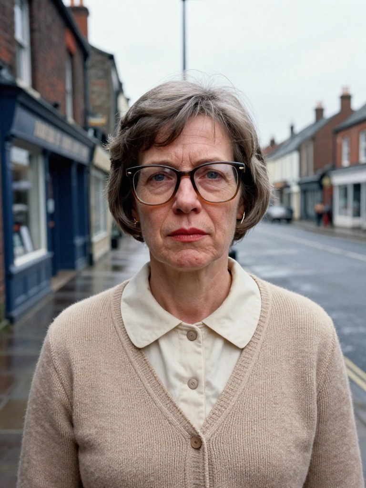
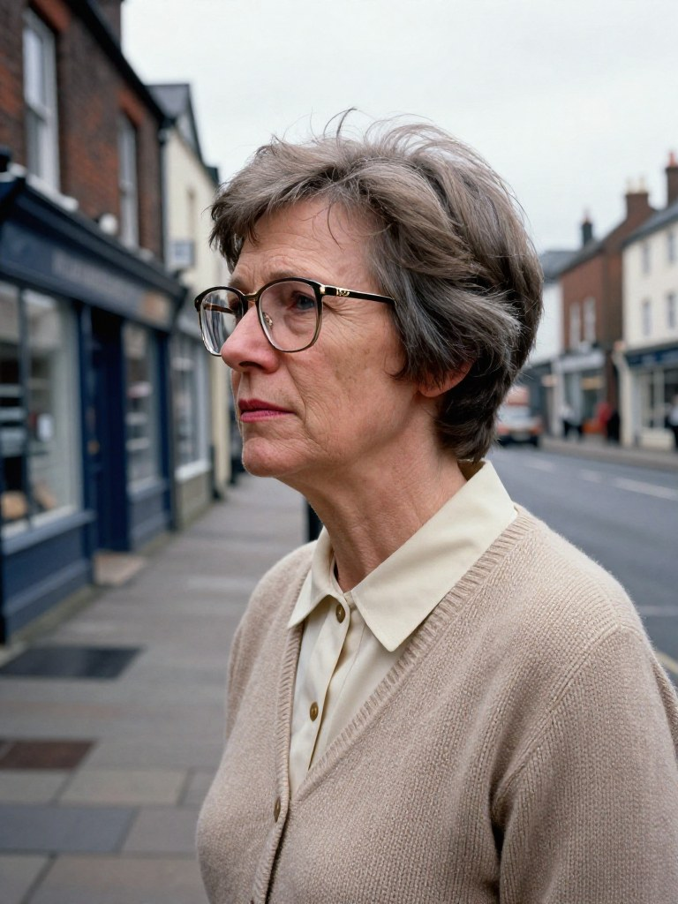
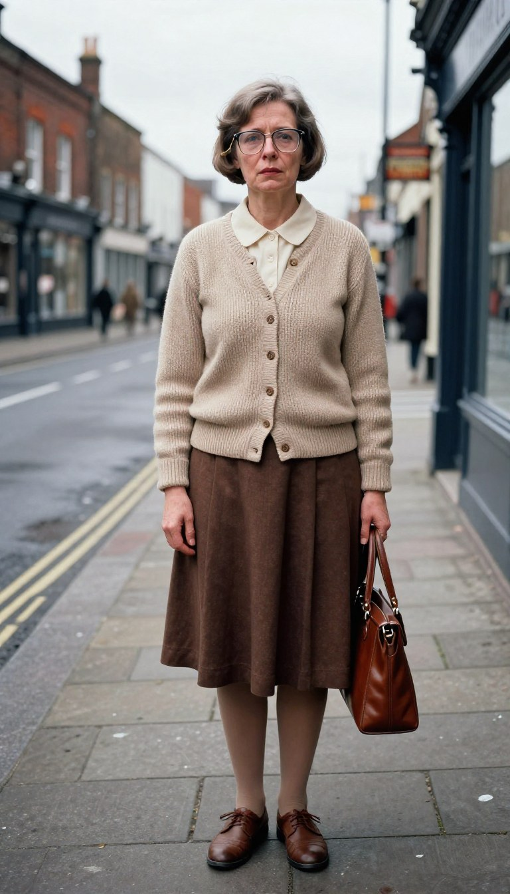

# Sheila Dunn

A principal of LEDGER (production/casting/CASTING.md). Until 24 September the
character was called Lena; the old name survives only as an internal id.

| | |
|---|---|
| **Age** | 53 (born 1937) |
| **Occupation** | Mickey's bookkeeper for thirty-one years, since she was 22. A widow in a council flat. |
| **Face** | Pale and lined, smoker's lines round the mouth, grey-blue eyes, a thin mouth; dentures. |
| **Body** | Small and neat, about 5 ft 3 in. |
| **Hair** | Greying brown, a short shampoo-and-set perm, done weekly. |
| **Clothes, 1990** | A beige hand-knitted cardigan buttoned over a cream blouse with a small round collar; a brown knee-length pleated skirt, flesh tights, flat brown lace-up shoes; a brown leather handbag. Large square tinted spectacles on a thin gold chain. No make-up but a plain lipstick. |
| **Voice** | Low, dry, unhurried; she withholds judgement in every line. |

## Concept portraits

Made in the image lane (Z-Image-Turbo, Apache-2.0), an invented person not
based on anyone, in the street's overcast light. What the MetaHuman is built
to once this sheet is approved.

| front | profile | full length |
|---|---|---|
|  |  |  |

## Three lines

1. "Thirty-one years I've kept Mickey's books, love. I know what every fare cost and who never paid it."
2. "Sit down, you're making the place look untidy. Now, what is it you think you want to know?"
3. "I saw what I saw. Whether I tell anybody else is a different question, isn't it."

Spoken by each voice candidate in voices/, named by letter so they are heard
blind; which letter is which is in ../voice-key.json.

## Approval

Face, clothes and voice are approved together, on the sitting's approval
page. The approval, when given, is SHEET.md.approval.json beside this file
(tools/approvals.py), and lapses if this sheet, its pictures or its voice
change.
